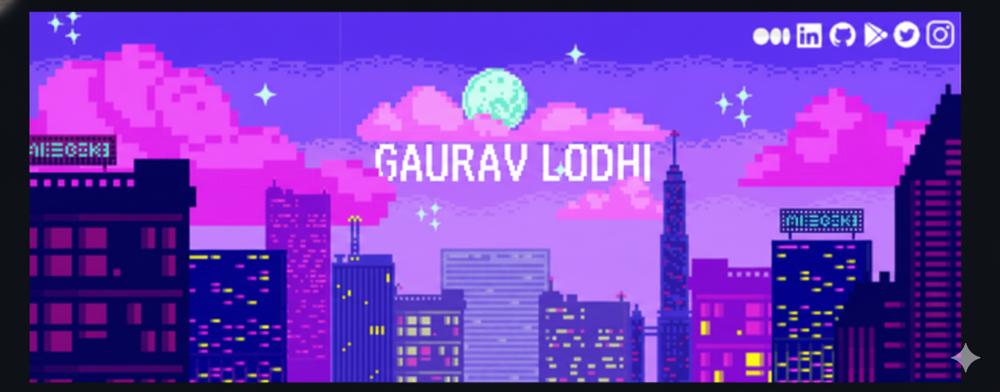
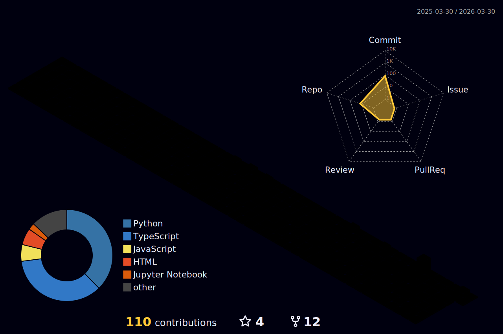

  

<h1 align="center">Hi there, I'm <a href="https://github.com/Gauravlodhi001" target="_blank">Gaurav Lodhi</a> 
</h1>

<h3 align="center">B.Tech CSE (AI-ML) @ VIT Bhopal | Aspiring AI/ML Engineer</h3>

  
  

 

## 💫 About Me

I am a dedicated student pursuing a **B.Tech in Computer Science and Engineering** with a specialization in **AI-ML** at **Vellore Institute of Technology, Bhopal** (Expected 2027). I focus on building a strong foundation in artificial intelligence and machine learning to create impactful, innovative solutions.

- 🔭 I’m currently working on **Fin-Risk (Financial Risk Prediction Model)**
- 🌱 I’m currently learning **OpenAI Whisper, Neural Machine Translation**
- 🤝 I served as **Project Co-lead** for Fin-Risk and am a **Core Member** of the Art Club.
- � Ask me about **Python, Java, C++, React, SQL, AWS**
- 📫 How to reach me: **gauravlodhi1604@gmail.com**

 

## 🚀 Projects

### SpeechSync - Real-Time Multilingual Translation (Aug 2024 – Dec 2024)
A collaborative AI project for a real-time speech-to-speech translation system.
- Supports over 10 languages with high accuracy.
- Uses **OpenAI Whisper** and **Google Text-to-Speech APIs**.
- Features a modular pipeline for real-time processing and efficient memory management.

### Fin-Risk - Financial Risk Prediction Model (Jan 2025 – Apr 2025)
A machine learning model to predict financial risk for investment portfolios.
- Analyzes historical market data and financial indicators.
- Utilizes a **Random Forest model** to provide insights and risk scores.

 

## 🛠️ Tech Stack

  

 

## 📊 GitHub Stats

 

 

 

## 🤝 Contribution

Running an open source project is not easy. It needs time, commitment and funding. If you found my work useful, please consider supporting me.

